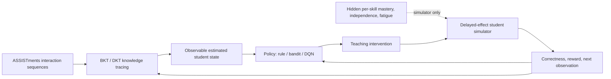

# Tracewise: knowledge tracing and adaptive intervention selection

> **Research prototype:** every policy outcome in this repository comes from
> an offline student simulator. No intervention policy was evaluated on real
> students, and the reported mastery gains are not evidence of classroom
> effectiveness. Knowledge tracing is evaluated retrospectively on historical
> ASSISTments records.

Tracewise asks: **Can a learned student state be used to choose teaching
interventions that improve long-horizon simulated learning outcomes over
random, rule-based, contextual-bandit, and myopic baselines?**

The project follows that question from data to decisions: leakage-safe
ASSISTments preprocessing, BKT versus DKT, contextual bandits, a delayed-effect
POMDP, and controlled DQN evaluation.


The animation replays the first fixed held-out evaluation seed (`200000`); it
was not selected for having a favorable outcome. It shows oracle mastery only
to make the research demo interpretable.

## Results at a glance

| Question | Result | Takeaway |
|---|---|---|
| Does deep sequence modeling improve knowledge tracing? | Test ROC-AUC: DKT **0.8531**, aligned BKT 0.7598 | DKT wins by 0.093 AUC, with better calibration, at much higher complexity. |
| Does student state help a contextual bandit? | LinUCB nonlinear-basis final-window accuracy: oracle **0.841**, no-state 0.827 | State helps modestly when represented nonlinearly; BKT/DKT estimates do not retain the oracle advantage. |
| Is delayed planning necessary? | With delayed effects: interleaving final mastery **0.558**, myopic 0.518, although myopic wins early reward | The simulator contains a real short- versus long-horizon tradeoff. |
| Do prerequisites create a real planning consequence? | Four-skill calibration: prerequisite-aware final mean mastery **0.3455** vs current-only 0.3263; paired gain **+0.0192** [0.0188, 0.0196] | Separate skill mastery and a validated prerequisite DAG create a measurable preparation-versus-direct-practice tradeoff. |
| Does DQN beat the strongest heuristic? | Canonical paired difference vs interleaving: **+0.0124** [0.0064, 0.0184] | One DQN wins, but this is not stable across training seeds. |
| Is the DQN result robust? | Three-seed DQN mean **0.5550 +/- 0.0208**; interleaving 0.5576 | DQN is competitive, not reliably superior. |
| Does Double DQN help, and why? | Ten-seed mean: Double DQN **0.5676**, vanilla 0.5474; paired seed-bootstrap gain **+0.0202** [0.0104, 0.0300] | Performance improves in 8/10 seeds, but seed SD is similar and Q-bias diagnostics do not support reduced overestimation. |
| Does a larger Double DQN budget help? | Validation-selected 5,000 vs 2,000 gain: **+0.0080** [0.0018, 0.0157]; exact endpoint: **-0.0142** [-0.0230, -0.0026] | More training offers better checkpoint-selection opportunities, but continuing to episode 5,000 degrades the final networks. |
| Does recurrent memory help in the POMDP? | With complete-episode replay matched: GRU **0.8374** vs feed-forward 0.5742; paired seed-bootstrap gain **+0.2632** [0.2577, 0.2695] | The feed-forward control stays near 0.58 and GRU wins all 10 seeds, providing strong evidence that history drives the gain. |
| What is the observability cost? | Oracle DQN 0.5700; BKT 0.5144; DKT 0.5151; no-state 0.5105 | Oracle state is valuable; current KT estimates add only a small gain over no state. |

Machine-readable headline values are saved in
[`docs/examples/portfolio_results.json`](docs/examples/portfolio_results.json).
The concise DQN interpretation is in
[`docs/dqn_results.md`](docs/dqn_results.md).

## System design



### Why this is a POMDP, not a chatbot

The learner's true mastery, independence, fatigue, and latent response type are
hidden. A policy sees only correctness history and a BKT/DKT-derived estimate,
then chooses an action whose effect can change later states. The same observed
history can therefore correspond to different hidden learner states, and the
best action can depend on delayed consequences.

That is a partially observable sequential decision problem. Natural-language
generation is deliberately outside the completed research core: a future text
layer could realize an intervention such as `socratic_hint`, but it would not
choose the intervention or supply the student state.

## Data and leakage control

The project uses the ASSISTments 2009 skill-builder data: **3,119 students,
123 skills, and 454,232 interactions** after preprocessing. The split is made
by student, not by row:

- train: 2,183 students;
- validation: 467 students;
- test: 469 students;
- student overlap across splits: zero.

Sequences are sorted chronologically within each student. Model selection uses
validation students; the aligned BKT/DKT headline is evaluated on the same
33,829 next-step test interactions. See [`data/README.md`](data/README.md) and
[`docs/experiments_kt.md`](docs/experiments_kt.md).

## What the experiments show

### Knowledge tracing

DKT improves test ROC-AUC from **0.7598 to 0.8531**, accuracy from 0.7224 to
0.7836, Brier score from 0.1857 to 0.1446, and ECE from 0.0203 to 0.0111. The
tradeoff is model size: 179,579 parameters for DKT versus 492 fitted BKT
parameters. DKT wins every reported sequence-length, position, and skill-
frequency slice.

### Contextual bandits

The first linear-context experiments showed that LinUCB could learn a strong
action mix, but oracle, estimated, and removed mastery inputs were nearly tied.
A nonlinear mastery-basis diagnostic exposed a modest oracle advantage
(final-window accuracy 0.841 versus 0.827 without state). BKT/DKT versions did
not preserve that advantage. This identifies representation and domain mismatch
as bottlenecks rather than pretending that more Monte Carlo samples solve them.

### Delayed reward and DQN

When delayed effects are disabled, the myopic policy reaches final mastery
1.000 and interleaving 0.831. When independence and fatigue carry consequences
forward, myopic still has the larger early reward (0.0128 versus 0.0072) but
loses on final mastery (0.518 versus 0.558). This validates the need for an
episodic method.

The canonical oracle-state DQN reaches 0.5700 final mastery and beats
interleaving by +0.0124 in a paired 500-episode comparison. Across three
independent DQN training seeds, however, final mastery is 0.5700, 0.5313, and
0.5637. Their mean is 0.5550, slightly below interleaving at 0.5576. The honest
conclusion is that DQN learned a competitive sequential policy, not that it
robustly won.

With only the bootstrap target changed, ten Double DQN agents average 0.5676
final mastery versus 0.5474 for ten matched vanilla agents. Double DQN wins
8/10 training seeds; the paired training-seed bootstrap estimates a +0.0202
gain [0.0104, 0.0300]. The apparent three-seed stability advantage does not
replicate: across-seed SD is 0.0147 versus 0.0157, with an inconclusive SD-
difference interval [-0.0101, 0.0065].

A Monte Carlo value diagnostic also rejects the simple proposed mechanism.
On each checkpoint's greedy-policy states, both methods underestimate return:
mean signed bias is -2.50 for vanilla and -5.14 for Double DQN. Double DQN's
absolute calibration error is higher by +2.38 [0.83, 4.05] across training
seeds. Performance improved here, but not through demonstrated reduction of
positive Q overestimation. See the
[`controlled Double DQN comparison`](docs/experiments_double_dqn.md).

Increasing Double DQN training from 2,000 to 5,000 episodes improves the mean
validation-selected checkpoint from 0.5676 to 0.5756, a matched-seed gain of
+0.0080 [0.0018, 0.0157]. The exact episode-5,000 endpoints instead fall from
0.5556 to 0.5414, a difference of -0.0142 [-0.0230, -0.0026]. Observed seed SD
falls in both views, but neither SD-difference interval excludes zero. More
experience helps only when validation-based checkpoint selection protects
against later degradation. See the
[`Double DQN training-budget study`](docs/experiments_double_dqn_budget.md).

### Multi-skill prerequisites

A separate four-skill simulator now tracks mastery independently for each
skill and validates a configurable prerequisite DAG. Positive learning is
gated by transitive prerequisite readiness; normal instruction can spill over
to a weak prerequisite, while `prerequisite_review` targets the weakest direct
prerequisite and transfers part of its gain to the current skill. Reward is
the change in mean mastery across skills.

Across 500 paired calibration episodes, a prerequisite-aware heuristic reaches
0.3455 final mean mastery versus 0.3263 for a current-skill-only heuristic:
**+0.0192 [0.0188, 0.0196]**. The rule overuses prerequisite review and leaves
the synthesis skill under-trained, intentionally exposing a balancing problem
for the next learned-policy phase. See the
[`multi-skill simulator study`](docs/experiments_multiskill_simulator.md).

Replacing the feed-forward network with a near-parameter-matched GRU changes
the result substantially. Across ten matched 5,000-episode seeds, selected GRU
agents average **0.8374** final mastery versus 0.5756 for feed-forward Double
DQN, a paired training-seed gain of **+0.2618 [0.2555, 0.2691]**. The GRU wins
all 10 seeds. Exact episode-5,000 networks show the same conclusion: 0.8212
versus 0.5414, a gain of +0.2798 [0.2684, 0.2907]. See the
[`initial recurrent Double DQN study`](docs/experiments_recurrent_double_dqn.md).

A follow-up removes its main replay confound. The original MLP was retrained
with the GRU's complete-episode replay, 150 transitions per loss,
episode-boundary updates, and exactly 62,000 updates. It remains at 0.5742,
while the GRU remains at 0.8374: **+0.2632 [0.2577, 0.2695]**, with 10/10 GRU
wins. Exact endpoints similarly differ by +0.2687 [0.2563, 0.2805]. This is
strong evidence that access to history drives the gain, although a timestep-
reset GRU would be the strictest architecture-preserving ablation. See the
[`matched-replay memory ablation`](docs/experiments_memory_ablation.md).

## Run the project

The reproducible environment targets Python 3.10.11. Select an existing Python
3.10 interpreter, then install either the core/dev dependencies or the full
optional stack:

```powershell
py -3.10 -m pip install -r requirements-dev.txt
py -3.10 -m pytest
```

The 77 tests use synthetic fixtures and need neither the unversioned raw CSV nor
saved checkpoints.

### Replay the portfolio demo without training

This command uses the committed lightweight trace and does not need a model
checkpoint:

```powershell
py -3.10 scripts/demo_policy_episode.py --replay docs/examples/dqn_episode_seed200000.json
```

To render the GIF again:

```powershell
py -3.10 scripts/demo_policy_episode.py --replay docs/examples/dqn_episode_seed200000.json --save-gif docs/media/dqn_episode.gif
```

If the local canonical checkpoint exists, run a new 50-step DQN simulation
without retraining it:

```powershell
py -3.10 scripts/demo_policy_episode.py --policy dqn --checkpoint results/checkpoints/dqn_oracle_best.pt --seed 200001
```

For a fresh simulation that needs no checkpoint at all, use the interleaving
baseline with `--policy interleave`.

### Reproduce the research pipeline

After obtaining `data/raw/skill_builder_data.csv` as described in
[`data/README.md`](data/README.md):

```powershell
py -3.10 scripts/run_preprocessing.py --config configs/config.yaml
py -3.10 scripts/fit_bkt.py --config configs/config.yaml
py -3.10 scripts/train_dkt.py --config configs/config.yaml
py -3.10 scripts/eval_kt.py --config configs/config.yaml
py -3.10 scripts/analyze_kt.py --config configs/config.yaml
py -3.10 scripts/eval_policies.py --config configs/config.yaml
py -3.10 scripts/eval_kt_policies.py --config configs/config.yaml
```

The canonical DQN configurations inherit the common project config while
keeping training and evaluation protocols explicit:

```powershell
py -3.10 scripts/train_dqn.py --config configs/dqn_train.yaml --device cpu
py -3.10 scripts/eval_dqn_suite.py --config configs/dqn_evaluation.yaml --suite full --device cpu
```

The ten-seed Double DQN experiment uses
`configs/double_dqn_train.yaml` and is evaluated with:

```powershell
py -3.10 scripts/eval_double_dqn.py --config configs/double_dqn_evaluation.yaml --device cpu
py -3.10 scripts/eval_q_overestimation.py --config configs/q_overestimation.yaml --device cpu --state-bank-mode shared_interleave
py -3.10 scripts/eval_q_overestimation.py --config configs/q_overestimation.yaml --device cpu --state-bank-mode on_policy
py -3.10 scripts/train_dqn.py --config configs/double_dqn_train_5000.yaml --observation-mode oracle --seed 42 --tag double_budget5000_seed42 --device cpu
py -3.10 scripts/eval_double_dqn_budget.py --config configs/double_dqn_budget_evaluation.yaml --device cpu
py -3.10 scripts/train_recurrent_dqn.py --config configs/recurrent_double_dqn_train.yaml --seed 42 --tag gru_seed42 --device cpu
py -3.10 scripts/eval_recurrent_double_dqn.py --config configs/recurrent_double_dqn_evaluation.yaml --device cpu
py -3.10 scripts/train_episode_replay_dqn.py --config configs/episode_replay_double_dqn_train.yaml --seed 42 --tag episode_replay_seed42 --device cpu
py -3.10 scripts/eval_memory_ablation.py --config configs/memory_ablation_evaluation.yaml --device cpu
py -3.10 scripts/validate_multiskill_env.py --config configs/multiskill_simulator.yaml
```

The full DQN suite expects the state/seed/discount checkpoints listed in
[`docs/experiments_dqn_phase4.md`](docs/experiments_dqn_phase4.md). Generated
checkpoints and raw result traces remain gitignored.

## Evidence and provenance

- [Knowledge-tracing experiments](docs/experiments_kt.md)
- [Contextual-bandit and estimated-state experiments](docs/experiments_policy.md)
- [Initial DQN training result](docs/experiments_dqn.md)
- [Controlled DQN evaluation](docs/experiments_dqn_phase4.md)
- [Vanilla DQN versus Double DQN](docs/experiments_double_dqn.md)
- [Double DQN training-budget study](docs/experiments_double_dqn_budget.md)
- [Feed-forward versus recurrent Double DQN](docs/experiments_recurrent_double_dqn.md)
- [Memory ablation with matched complete-episode replay](docs/experiments_memory_ablation.md)
- [Multi-skill prerequisite simulator](docs/experiments_multiskill_simulator.md)
- [Artifact hashes and lineage](docs/artifacts.md)
- [Project roadmap and experiment log](docs/roadmap.md)

## Limitations

- All policy results depend on a hand-designed simulator; they do not establish
  causal effects or real learning gains.
- Oracle-state policies are upper bounds and are not deployable.
- BKT/DKT were fit to ASSISTments while policy evaluation uses an abstract
  simulator, creating a deliberate but important domain mismatch.
- Completed policy comparisons still use the legacy single-skill environment.
  The new four-skill prerequisite simulator is calibrated, but learned-policy
  and BKT/DKT observation comparisons have not yet been run on it.
- Ten matched training seeds support the Double DQN performance comparison,
  but remain a modest sample for variance and mechanism claims.
- The value diagnostic uses finite Monte Carlo rollouts in a hand-designed,
  short-horizon simulator and does not establish a causal path from Q bias to
  policy performance.
- The 5,000-episode selected-checkpoint condition has more opportunities to
  optimize against the reused validation set; the exact-endpoint comparison is
  reported separately to expose this selection effect.
- Matching complete-episode replay strongly supports a history effect, but the
  MLP and GRU still differ in computation and parameter count; a timestep-reset
  GRU is the strictest remaining memory ablation.
- Multi-skill/prerequisite dynamics remain future work.
- No LLM/RAG tutor, Arabic interface, or real-user study is claimed as complete.

The research core is portfolio-ready at Phase 5. LLM/RAG and a user interface
remain optional product layers, not prerequisites for the RL result.
