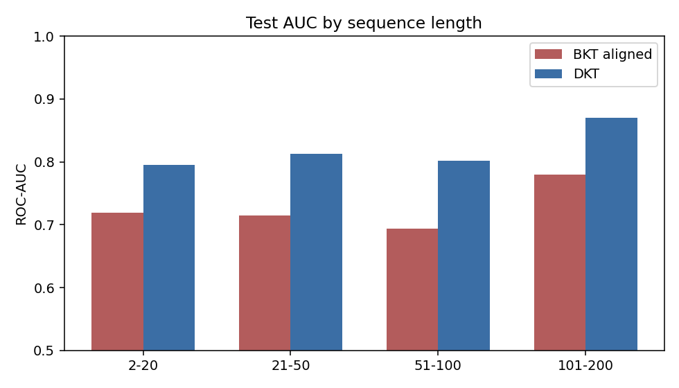
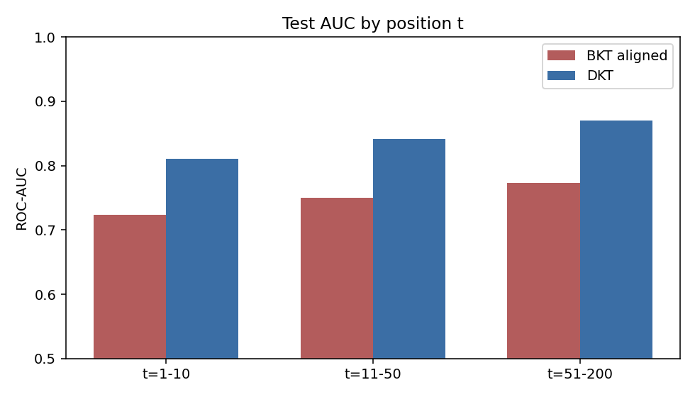
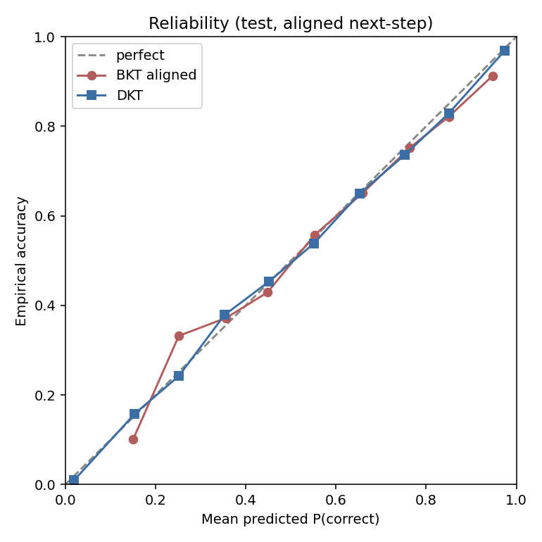

# BKT vs DKT (ASSISTments 2009 skill-builder)

Student-level 70/15/15 split, seed 42. Config: `configs/config.yaml`.
DKT: embedding 128, LSTM 128, 1 layer, max_seq_len 200, early stop on val AUC
(best checkpoint epoch 11). Test metrics below are **aligned next-step**
unless labeled `BKT_full`.

DKT predicts P(correct) for interaction t+1 given (skill_t, correct_t).
It cannot score t=0; histories are truncated at 200. **BKT_aligned** uses
the same positions. **BKT_full** is the M2 protocol (every timestep, no
truncation) and is not a matched comparison.

## Headline (Kaggle T4, 2026-08-26)

| Model | Split | ROC-AUC | Accuracy | N |
|---|---|---|---|---|
| BKT_full | val | 0.7652 | 0.7479 | 56559 |
| BKT_aligned | val | 0.7473 | 0.7176 | 33319 |
| DKT | val | **0.8386** | 0.7732 | 33319 |
| BKT_full | test | 0.7418 | 0.7493 | 71191 |
| BKT_aligned | test | 0.7598 | 0.7224 | 33829 |
| DKT | test | **0.8531** | 0.7836 | 33829 |

Fair test gap (aligned): **+0.093 AUC** (0.8531 vs 0.7598).

| Model | params | Test AUC | Acc | Brier ↓ | ECE ↓ | n |
|---|---|---|---|---|---|---|
| BKT aligned | 492 | 0.7598 | 0.7224 | 0.1857 | 0.0203 | 33829 |
| DKT | 179,579 | **0.8531** | 0.7836 | **0.1446** | **0.0111** | 33829 |

DKT uses ~365× more parameters and wins on ranking **and** probability quality
(lower Brier, lower ECE). That last part is not the usual KT cliché (BKT is
often better calibrated); on this split and protocol it is not.

## Where DKT wins

All slices are test / aligned. Delta = DKT − BKT.

### Sequence length (student history truncated at 200)

| slice | n | BKT AUC | DKT AUC | Δ |
|---|---|---|---|---|
| 2–20 | 1809 | 0.7194 | 0.7954 | +0.076 |
| 21–50 | 4189 | 0.7147 | 0.8130 | +0.098 |
| 51–100 | 4974 | 0.6934 | 0.8014 | +0.108 |
| 101–200 | 22857 | 0.7800 | 0.8706 | +0.091 |

The overall number is dominated by long students (101–200 is 67.6% of test
steps). That is a caveat, not a dismissal: DKT still wins on short histories
(+0.076 on length 2–20). So this is not “LSTM only helps when the sequence
is long.”

### Position in the sequence

| slice | n | BKT AUC | DKT AUC | Δ |
|---|---|---|---|---|
| t=1–10 | 4664 | 0.7236 | 0.8109 | +0.087 |
| t=11–50 | 11284 | 0.7497 | 0.8414 | +0.092 |
| t=51–200 | 17881 | 0.7736 | 0.8697 | +0.096 |

Both models improve as t grows (more evidence). The DKT gap is already large
in the first 10 steps and widens slightly later, which is what you want if
the LSTM hidden state is accumulating cross-skill history that per-skill BKT
cannot share.

### Skill frequency (train counts)

| slice | n | BKT AUC | DKT AUC | Δ |
|---|---|---|---|---|
| head (≥ median) | 31296 | 0.7631 | 0.8563 | +0.093 |
| tail (< median) | 2533 | 0.7167 | 0.8114 | +0.095 |

The gap does not collapse on rare skills. Tail n is smaller, so treat the
exact +0.095 as noisier than the head number, but the sign is not an artifact
of popular skills only.

## Calibration

DKT’s reliability curve sits closer to the diagonal (ECE 0.011 vs 0.020).
BKT never predicts P(correct) < 0.1 (guess/slip bounds); DKT uses the full
[0, 1] range and is still well calibrated at both extremes.

## How to talk about this (interview)

1. **Claim:** On ASSISTments 2009 skill-builder, student-level holdout, aligned
   next-step prediction, LSTM DKT beats 4-parameter BKT by ~0.09 AUC on test.
2. **Not a leak:** splits are by student; user overlap is 0.
3. **Not an apples-to-oranges table:** quote BKT_aligned vs DKT, not BKT_full.
4. **Robustness:** the gap holds on short sequences, early timesteps, and tail
   skills. The overall metric is weighted toward long students; say that.
5. **Cost:** 492 vs 180k parameters. DKT is better here; it is not free.
6. **Calibration:** on this run DKT is also better calibrated. Do not recite
   “BKT is always better calibrated” if your plot says otherwise.

## What this does *not* show

- That DKT would win on every KT dataset or with a Transformer KT model.
- That a better student model improves *teaching* — see M5 / M5.5 in
  `docs/experiments_policy.md` (simulated; M5.5 uses estimated KT state).
