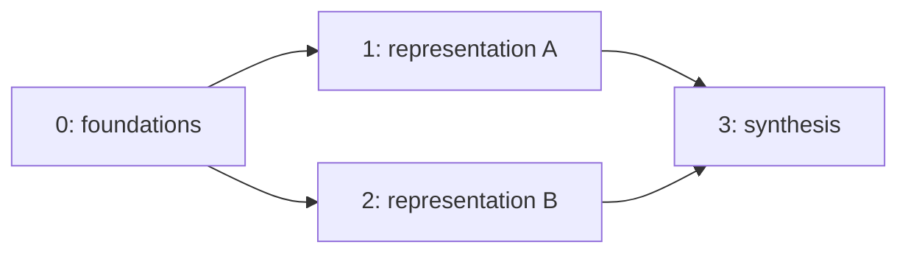

# Multi-skill prerequisite simulator

## Purpose

The original tutoring environment tracks one focus skill. This phase adds a
separate simulator for studying whether recurrent policies can coordinate
learning across several skills connected by prerequisites. It does not yet
train a new RL policy.

Every outcome remains synthetic. No real students or classroom interventions
were evaluated.

## State and prerequisite graph

An episode contains a mastery vector
`m = [m_0, ..., m_(K-1)]`, with one independently changing value per skill.
The configured four-skill calibration graph is a diamond:



The graph is configurable and validated as a directed acyclic graph. Duplicate,
out-of-range, self, and cyclic prerequisite edges fail at configuration time.
Transitive prerequisite closures and skill depths are computed by the
environment.

The curriculum exposes a current skill at every step using the repeating
sequence `0, 1, 0, 2, 1, 2, 3, 3`. Current skill identity and the graph are
task context; they are not hidden learner state.

## Transition design

Positive learning on a skill with prerequisites is gated by prerequisite
readiness:

`gate = floor + (1 - floor) * mean(transitive prerequisite mastery)`

with a configured floor of 0.35. This allows some learning before complete
prerequisite mastery while making preparation consequential.

- Normal instructional actions primarily affect the current skill. A small
  positive spillover goes to its weakest direct prerequisite.
- `prerequisite_review` targets the weakest direct prerequisite. A fraction of
  its positive gain transfers to the current skill.
- If that target prerequisite has prerequisites of its own, its gain is gated
  by their readiness too.
- Independence, fatigue, learner preference, and response randomness retain
  the delayed-effect dynamics from the single-skill simulator and remain
  hidden.

The scalar reward is the change in mean mastery across all skills. It therefore
telescopes exactly over an episode:

`sum_t reward_t = final mean mastery - initial mean mastery`

Every step records the acted skill, actual target skill, per-skill mastery
deltas, prerequisite readiness, gate, response probability, and transfer
effects in diagnostic mode.

## Observation modes

The observation contains:

- one mastery signal per skill;
- recent response/history features;
- current difficulty and episode progress;
- readiness of the current skill's transitive prerequisites;
- a current-skill one-hot vector;
- previous-action one-hot features.

`oracle` exposes the true mastery vector. `estimated` asks an online BKT/DKT
tracker for every skill and updates the tracker for the action's actual target
skill. `no_state` masks mastery, readiness, and response-derived features while
retaining difficulty, progress, current skill, and previous action. These
modes prepare the later GRU oracle/BKT/DKT/no-state comparison.

## Calibration

Three fixed policies were evaluated on 500 common episode seeds
(`300000..300499`):

| Policy | Final mean mastery | Mean prerequisite readiness | Accuracy |
|---|---:|---:|---:|
| Random | 0.3265 | 0.5572 | 0.3573 |
| Current-skill-only heuristic | 0.3263 | 0.5466 | 0.3467 |
| Prerequisite-aware heuristic | **0.3455** | **0.6040** | **0.4329** |

The prerequisite-aware minus current-only paired difference in final mean
mastery is **+0.0192**, with episode-bootstrap 95% interval
**[+0.0188, +0.0196]**. It wins on all 500 paired episodes. This demonstrates
that the prerequisite mechanism affects attainable outcomes rather than being
unused metadata.

The hand rule is not optimal. It selects `prerequisite_review` on 70.9% of
steps, raising foundation mastery to 0.5166 but leaving synthesis mastery at
0.2339. A learned policy must balance foundational preparation against direct
practice on later skills; that tradeoff is the intended next research problem.

## Validation and limitations

Automated tests cover graph validation, per-skill mastery, prerequisite gating,
current/prerequisite transfer, observation masking, tracker targeting,
curriculum advancement, deterministic seeded trajectories, forks, reward
telescoping, and configuration loading.

The graph and transition coefficients are hand-designed. The calibration shows
internal consistency, not realism or educational effectiveness. Before making
claims about knowledge-tracing quality, the next phases must train recurrent
policies and compare oracle, BKT, DKT, and no-state observations on held-out
simulator seeds.

## Reproduction

```powershell
py -3.10 scripts/validate_multiskill_env.py --config configs/multiskill_simulator.yaml
py -3.10 -m pytest tests/test_multiskill_environment.py -q
```

Raw output is written to `results/multiskill_environment_validation.json` and
remains gitignored. The compact durable result is
[`examples/multiskill_environment_results.json`](examples/multiskill_environment_results.json).
